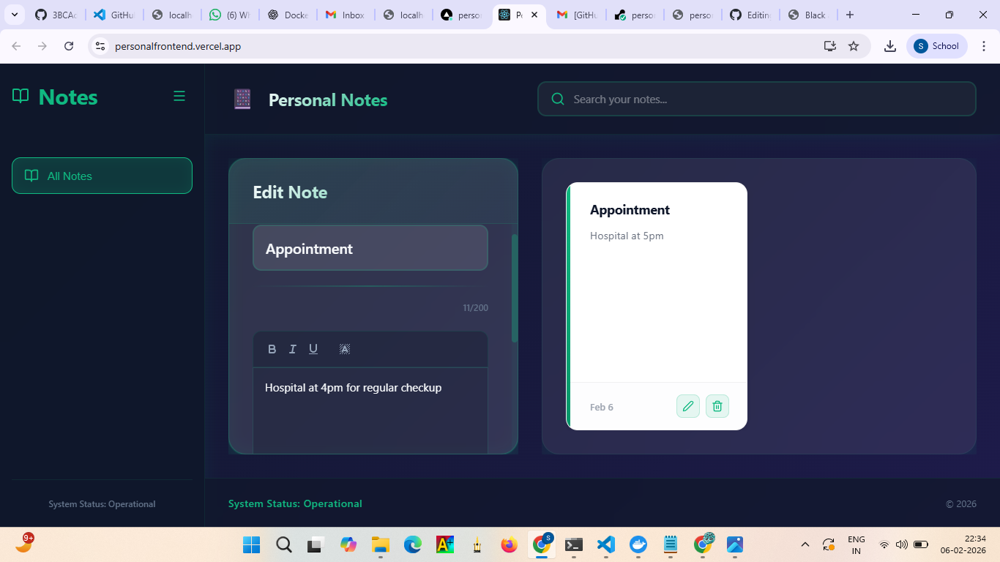
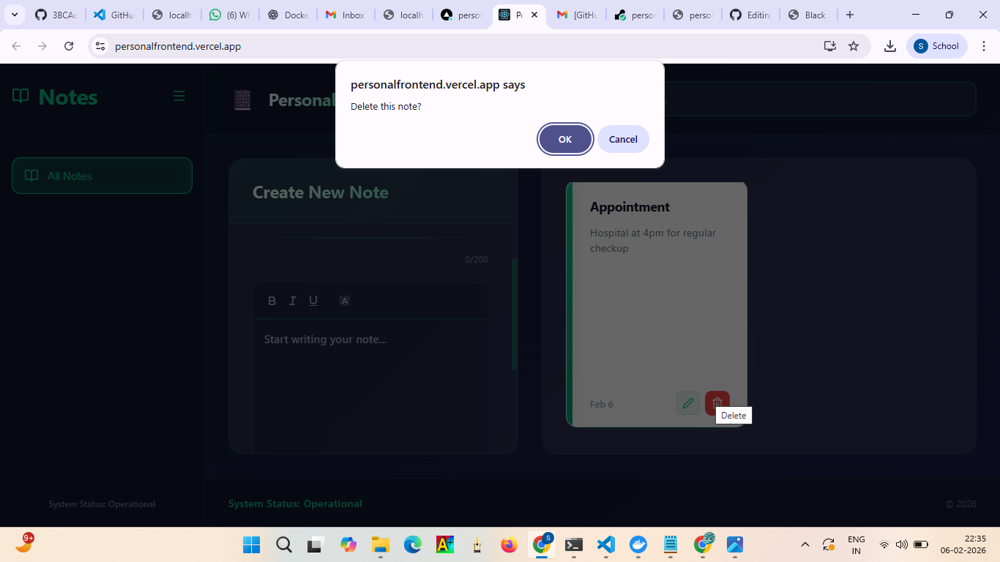
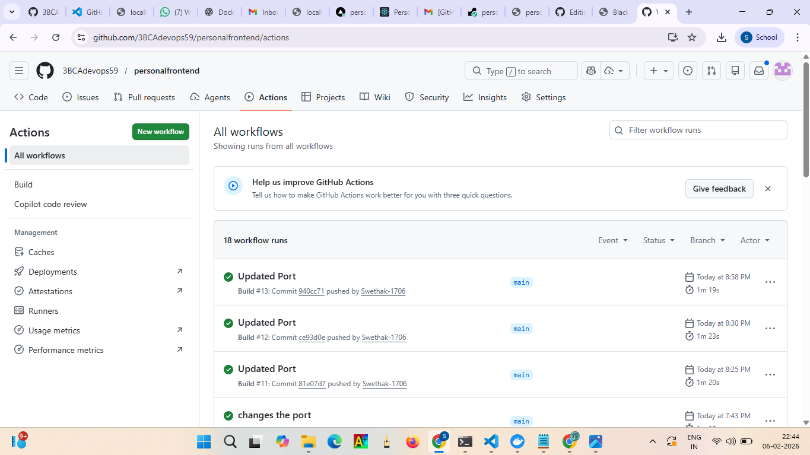
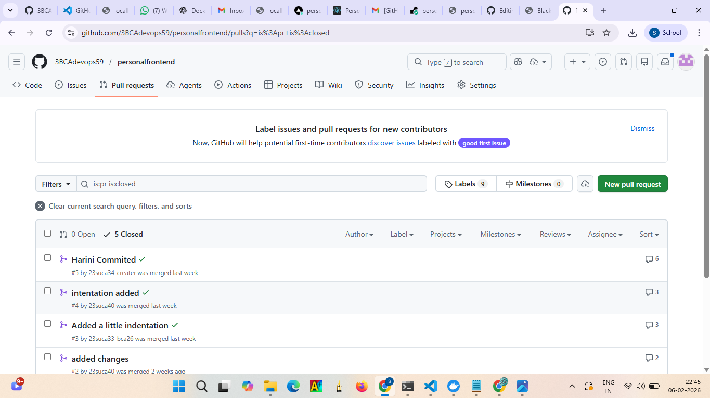
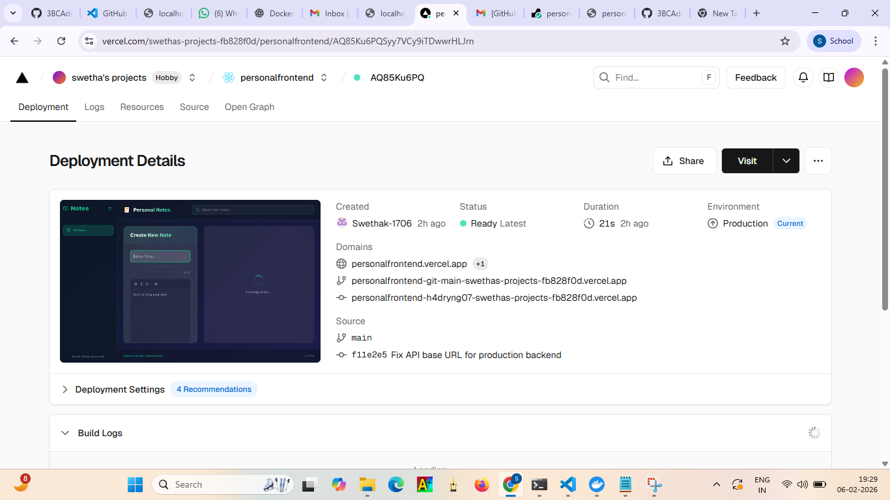

# Personal Notes Organizer - Frontend

## Project Overview
Personal Notes Organizer is a web-based application that enables users to create, view, update, and delete personal notes. The frontend is implemented using React.js and integrates with a backend REST API deployed on Render. The user interface is intentionally clean and supports real-time CRUD workflows.

This README is structured for technical reviewers and provides a full architectural, operational, and implementation-oriented view of the frontend.

## Architecture Overview
The frontend is a single-page React application that communicates with a RESTful backend. The frontend is responsible for UI rendering, client-side validation, and HTTP communication. The backend owns persistence and business rules.

ASCII architecture view:
```
User Browser
	|
	| HTTP (JSON)
	v
React Frontend (Vercel)
	|
	| REST API calls via Axios
	v
Backend API (Render)
```

## Technology Stack
What it is: The technology stack identifies the core tools used to build, test, and deploy the application.
Why it is used: Each selection supports maintainability, developer productivity, and deployment reliability.
How it works: The stack layers are combined to deliver a responsive, API-driven UI.

- React.js: Component-based UI library for building a responsive single-page application.
- Axios: HTTP client used to standardize API communication and error handling.
- HTML5 and CSS3: Standards for layout, accessibility, and presentation.
- JavaScript (ES6): Modern language features for readable and maintainable code.
- Vercel (Deployment): Managed hosting for static frontend builds and continuous deployment.

## Functional Features
What it is: The feature set defines the core capabilities of the notes application.
Why it is used: These features map directly to CRUD requirements and standard user workflows.
How it works: The UI interacts with the REST API, and state updates are reflected immediately.

- Create new notes
- View all notes
- Edit existing notes
- Delete notes
- Search notes by title or content
- Responsive UI for different device sizes
- Environment-based API configuration

## Environment Configuration
What it is: Environment configuration externalizes runtime settings from source code.
Why it is used: It allows different API targets for development, testing, and production.
How it works: React reads environment variables prefixed with `REACT_APP_` at build time.

Create a `.env` file in the root directory:

```env
REACT_APP_API_BASE_URL=https://personalbackend-1-0.onrender.com
```

## Project Structure
What it is: The structure organizes UI components, service logic, and application entry points.
Why it is used: It enforces separation of concerns and simplifies code navigation.
How it works: Components handle rendering, and services encapsulate API requests.

```
src/
 ├── components/
 │   ├── NoteForm.js
 │   └── NoteList.js
 ├── services/
 │   └── NoteService.js
 ├── App.js
 ├── index.js
 └── App.css
```

## API Integration
What it is: The frontend integrates with a REST API to perform note operations.
Why it is used: It provides persistence and server-side logic for CRUD workflows.
How it works: Axios performs HTTP requests using a base URL derived from the environment.

```javascript
const API_BASE_URL = `${process.env.REACT_APP_API_BASE_URL}/api/notes`;
```

## Commands
Each command is described with its purpose and operational mechanics.

### Install dependencies
```bash
npm install
```
What it is: Installs all project dependencies into `node_modules`.
Why it is used: The app cannot build or run without its declared dependencies.
How it works: npm reads `package.json` and resolves exact versions using `package-lock.json` when available.

### Start the development server
```bash
npm start
```
What it is: Launches the local development server with hot reload.
Why it is used: Enables rapid UI iteration with immediate visual feedback.
How it works: Create React App starts the Webpack dev server and serves the app at http://localhost:3000.

### Run tests
```bash
npm test
```
What it is: Executes the unit test suite.
Why it is used: Ensures application logic and components remain stable across changes.
How it works: Jest is invoked in watch mode, using React Testing Library defaults.

### Build for production
```bash
npm run build
```
What it is: Produces an optimized, minified production bundle.
Why it is used: Deployment platforms require static, optimized assets.
How it works: Create React App compiles and optimizes assets into the `build/` directory with cache-friendly hashes.

### Preview the production build locally (optional)
```bash
npx serve -s build
```
What it is: Serves the production build using a static file server.
Why it is used: Validates production behavior before deployment.
How it works: The `serve` package hosts the `build/` directory as a local static site.

## Deployment
What it is: Deployment publishes the compiled frontend to a production host.
Why it is used: It makes the application available to end users and reviewers.
How it works: Vercel consumes the repository, builds the React app, and serves static assets via its CDN.

Frontend is deployed on Vercel.

Live URL:
https://personalfrontend.vercel.app

## Quality and Collaboration Evidence
This section documents code quality checks and collaboration practices used during development.

- SonarQube analysis indicates static analysis and quality checks.
- A structured pull request demonstrates collaboration and review readiness.

## Screenshots and Evidence
Each screenshot is included with a formal rationale and a precise creation process.

### Create the New and Update the Notes Dashboard

What it is: The primary interface for creating and updating notes.
Why it is used: It validates the central user workflow for CRUD operations and form handling.
How it works: The user submits a note via the form; the UI updates to reflect the new or edited record.
How created: Open the application, enter a title and content, submit to create a note, then select a note to edit and save. Capture the screen after both create and update actions are visible.

### Delete New Note

What it is: The interface state after a note deletion.
Why it is used: It verifies destructive actions and confirms the list refreshes correctly.
How it works: The delete action triggers an API request; the UI updates to remove the deleted item.
How created: Create a note, click its delete action, confirm the removal (if prompted), and capture the UI with the note removed from the list.

### Error Handling

### What it is:
       The UI state displayed when an API error occurs.
### Why it is used:
       It demonstrates robust failure handling and clear user messaging.
### How it works: 
       A failed API call returns an error that is caught and rendered in the UI.
### How created: 
      Temporarily stop or misconfigure the API URL in `.env`, reload the app, trigger a fetch or save action, and capture the displayed error message.

### Sonar Analysis

### What it is:
     The static analysis results for the frontend codebase.
### Why it is used:
     It supports claims of maintainability and quality standards.
### How it works: 
     The Sonar scanner submits metrics and issue data to SonarQube for analysis.
### How created: 
     Run the Sonar scanner with the project key and configured server, then capture the SonarQube dashboard summary after analysis completes.

### Proper Pull Request

### What it is:
    A documented pull request with descriptive context and checks.
### Why it is used:
   It demonstrates professional collaboration practices and review readiness.
### How it works: 
   A feature branch is reviewed and validated before merge.
### How created: 
     Open a PR from a feature branch, fill in the template (if any), ensure checks pass, then capture the PR overview page.

### Vercel Deployment

### What it is:
       The deployment success screen for the hosted frontend.
#### Why it is used:
      It verifies the production pipeline and confirms a successful build.
### How it works: 
    Vercel builds the app from the repository and serves the static assets.
### How created:
 Connect the repository to Vercel, trigger a deployment, wait for build completion, and capture the deployment success screen.

### Vercel Deployment with Domain Name

### What it is: 
     The deployment configuration with a custom domain.
#### Why it is used: 
      It confirms production routing and domain verification.
### How it works: 
      DNS records point to Vercel and the domain is validated in project settings.
#### How created: 
     Add the domain in Vercel project settings, update DNS records, wait for verification, and capture the domain status page.

### DevOps Documentation (PDF)
[DevOps PDF](./screenshots/Deveops.pdf)
### What it is:
     A DevOps reference document for the frontend.
### Why it is used:
     It provides pipeline notes, operational practices, and evaluation artifacts.
### How it works:
 The document captures the intended DevOps process and evidence in a single distributable file.
### How created:
 Export or save the documentation as a PDF and place it in the `screenshots/` folder for repository access.

## Frontend Screenshot Checklist
1. Vercel deployed app homepage
2. Create new note screen
3. Notes list with data
4. Delete, update, search notes working
5. Browser console showing successful API call (200 OK)
